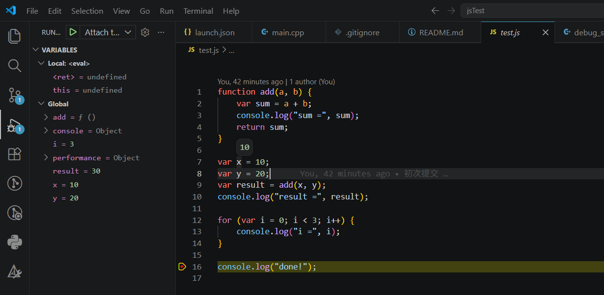

# QuickJS CDP Debugger

基于 Chrome DevTools Protocol (CDP) 的 QuickJS 脚本调试器，支持在 VS Code 中对自定义 QuickJS 引擎进行断点调试。



## 项目结构

```
jsTest/
├── CMakeLists.txt              # 顶层构建文件
├── README.md
├── test.js                     # 测试脚本
├── quickjs/                    # QuickJS 引擎（已修改，含调试 API）
│   ├── quickjs.h/c             #   核心引擎
│   └── ...
├── debugger/                   # CDP 调试器
│   ├── CMakeLists.txt          #   调试器构建文件
│   └── src/
│       ├── main.cpp            #   入口：创建 QuickJS 运行时 + 启动调试服务
│       ├── websocket_server.h/cpp  # WebSocket 服务器（端口 9229）
│       ├── cdp_handler.h/cpp   #   CDP 协议消息分发与处理
│       ├── debug_session.h/cpp #   调试核心：断点、单步、暂停、变量捕获
│       ├── json.h              #   轻量 JSON 解析/序列化
│       └── platform.h          #   跨平台 Socket 抽象
├── compat/
│   └── msvc/
│       └── stdatomic.h         # MSVC < 17.5 的 C11 stdatomic 兼容垫片
└── .vscode/
    └── launch.json             # VS Code 调试 attach 配置
```

## 架构概览

```
  VS Code (DevTools 前端)
       │
       │  WebSocket (ws://127.0.0.1:9229/debug)
       ▼
  ┌─────────────────┐
  │ WebSocketServer │  接受连接、WebSocket 握手、帧编解码
  └────────┬────────┘
           │
  ┌────────▼────────┐
  │   CDPHandler    │  解析 CDP JSON 消息，分发到对应 domain 处理
  └────────┬────────┘
           │
  ┌────────▼────────┐
  │  DebugSession   │  调试核心逻辑
  │  ─ 断点管理      │  set/remove breakpoint
  │  ─ 单步控制      │  step over / into / out / continue
  │  ─ 暂停/恢复     │  pause / resume
  │  ─ 调用栈捕获    │  capture call frames + scope variables
  │  ─ op_handler   │  每条 JS 指令回调（检查断点/单步）
  └────────┬────────┘
           │
  ┌────────▼────────┐
  │   QuickJS 引擎   │  执行 JS 脚本，通过调试 API 回调
  │  ─ JS_SetOPChangedHandler()    每条 opcode 触发回调
  │  ─ JS_GetStackDepth()          获取调用栈深度
  │  ─ JS_GetLocalVariablesAtLevel()  获取指定层级局部变量
  │  ─ JS_FreeLocalVariables()     释放变量数组
  └─────────────────┘
```

### 调试流程

1. `qjs_debug` 启动 → 加载脚本 → 在端口 9229 启动 WebSocket 服务，等待调试器连接
2. VS Code 通过 `launch.json` 的 attach 配置连接到 `ws://127.0.0.1:9229/debug`
3. VS Code 发送 `Debugger.enable`、`Debugger.setBreakpointByUrl` 等 CDP 命令
4. `CDPHandler` 解析消息并调用 `DebugSession` 设置断点
5. `Runtime.runIfWaitingForDebugger` 解除阻塞，开始执行脚本
6. QuickJS 每执行一条 opcode 触发 `op_handler` → 检查断点/单步条件
7. 命中断点时 `do_pause()` 捕获调用栈和变量，发送 `Debugger.paused` 事件，阻塞等待
8. VS Code 收到暂停事件后显示断点位置和变量；用户操作 continue/step 发送对应 CDP 命令
9. `DebugSession` 收到命令后解除阻塞，脚本继续执行

## 编译

### 环境要求

| 平台    | 编译器                         | 其它        |
|---------|-------------------------------|------------|
| Windows | MSVC (VS2019+) 或 MinGW-w64   | CMake ≥ 3.10 |
| Linux   | GCC 或 Clang                   | CMake ≥ 3.10 |

### Windows (MSVC)

```powershell
# 1. 打开 VS 开发者命令行（或手动初始化环境）
& "D:\Program Files (x86)\Microsoft Visual Studio\2019\Community\VC\Auxiliary\Build\vcvarsall.bat" x64

# 2. 配置 + 编译
mkdir build
cd build
cmake .. -G "NMake Makefiles" -DCMAKE_BUILD_TYPE=Debug
nmake
```

编译产物在 `build/debugger/qjs_debug.exe`。

### Windows (MinGW)

```bash
mkdir build && cd build
cmake .. -G "MinGW Makefiles" -DCMAKE_BUILD_TYPE=Debug
mingw32-make
```

### Linux

```bash
mkdir build && cd build
cmake .. -DCMAKE_BUILD_TYPE=Debug
make -j$(nproc)
```

### 关键构建选项说明

- **MSVC < 17.5**：自动注入 `compat/msvc/stdatomic.h` 垫片解决缺失 C11 `<stdatomic.h>` 的问题
- **GCC / Clang / MinGW**：自动定义 `EMSCRIPTEN` 宏，强制 QuickJS 中 `DIRECT_DISPATCH=0`，确保 `JS_SetOPChangedHandler` 回调在每条指令上触发（若 `DIRECT_DISPATCH=1`，computed-goto 会跳过 op_handler 调用）

## 运行

### 基本运行

```bash
# 启动调试器，等待 VS Code 连接后再执行脚本
./build/debugger/qjs_debug --inspect-brk test.js

# 启动调试器，脚本直接开始执行（仅断点生效）
./build/debugger/qjs_debug --inspect test.js
```

启动后会输出：
```
Debugger listening on ws://127.0.0.1:9229/debug
Waiting for debugger to connect...
```

### 在 VS Code 中调试

1. 启动 `qjs_debug`：
   ```bash
   ./build/debugger/qjs_debug --inspect-brk test.js
   ```

2. 在 VS Code 中打开工作区，确保 `.vscode/launch.json` 包含：
   ```json
   {
       "configurations": [{
           "type": "node",
           "request": "attach",
           "name": "Attach to QuickJS",
           "address": "127.0.0.1",
           "port": 9229,
           "localRoot": "${workspaceFolder}",
           "remoteRoot": "${workspaceFolder}",
           "skipFiles": ["<node_internals>/**"]
       }]
   }
   ```

3. 在 `test.js` 中设置断点

4. 按 `F5` 选择 "Attach to QuickJS" 启动调试

5. VS Code 连接后脚本开始执行，命中断点时自动暂停，可查看变量、调用栈，支持单步等操作

### 命令行参数

| 参数             | 说明                                      |
|-----------------|-------------------------------------------|
| `--inspect`      | 启动调试服务，脚本立即执行                    |
| `--inspect-brk`  | 启动调试服务，等待调试器连接并发送 resume 后才执行 |
| `--port <N>`     | 指定 WebSocket 监听端口（默认 9229）          |

### Chrome DevTools 调试

除 VS Code 外，也可用 Chrome 调试：

1. 启动 `qjs_debug --inspect-brk test.js`
2. 打开 Chrome 浏览器，访问 `chrome://inspect`
3. 在 "Remote Target" 中找到并点击 "inspect"

## 支持的 CDP 命令

| Domain    | 方法                              |
|-----------|----------------------------------|
| Debugger  | `enable` / `disable`             |
| Debugger  | `setBreakpointByUrl`             |
| Debugger  | `removeBreakpoint`               |
| Debugger  | `setBreakpointsActive`           |
| Debugger  | `getScriptSource`                |
| Debugger  | `resume`                         |
| Debugger  | `stepOver` / `stepInto` / `stepOut` |
| Debugger  | `pause`                          |
| Debugger  | `setPauseOnExceptions`           |
| Runtime   | `enable`                         |
| Runtime   | `runIfWaitingForDebugger`        |
| Runtime   | `getProperties`                  |
| Runtime   | `evaluate`                       |
| Profiler  | `enable` / `disable`             |

## QuickJS 调试 API

本项目依赖的 QuickJS 扩展 API（在 `quickjs.h` 中声明）：

```c
// 每条 opcode 执行时的回调
typedef int JSOPChangedHandler(JSContext *ctx, uint8_t op,
    const char *filename, const char *funcname,
    int line, int col, void *opaque);
void JS_SetOPChangedHandler(JSContext *ctx, JSOPChangedHandler *cb, void *opaque);

// 获取当前调用栈深度
int JS_GetStackDepth(JSContext *ctx);

// 获取指定栈帧层级的局部变量
JSLocalVar *JS_GetLocalVariablesAtLevel(JSContext *ctx, int level, int *pcount);

// 释放 JS_GetLocalVariablesAtLevel 返回的变量数组
void JS_FreeLocalVariables(JSContext *ctx, JSLocalVar *vars, int count);
```

## 注意事项

- **不要修改 `quickjs/` 目录下的源码**，所有适配通过外部编译选项和兼容层实现
- Windows 上路径大小写不敏感，调试器内部已做统一处理
- `--inspect-brk` 模式下程序会阻塞直到调试器连接并发送 `runIfWaitingForDebugger`
